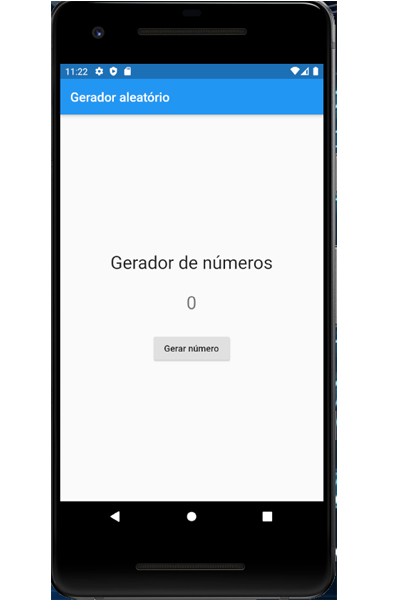

<!-- markdownlint-disable MD033 -->
# numero_aleatorio

## Flutter: Criando a primeira aplicação

Construção da primeira aplicação no Flutter, utilizando os Widgets `StatelessWidget` e `StatefulWidget` para trabalhar com captura de eventos.

|Indice|Assunto|
|:--:|:--|
|01|[Introdução](docs/info-01.md)  Entendendo melhor o projeto e o que é necessário para sua aplicação.|
|02|[Uma primeira visão do exemplo](docs/info-02.md)  Entendendo o conceito de componentes estáticos e dinâmicos, conhecidos como `StatelessWidgets` e `StatefulWidgets`.|
|03|[Evento onPressed: visão do código](docs/info-03.md)  Entendendo o funcionamento do evento do clique do botão deste projeto.|
|04|[Entendendo o Exemplo](docs/info-04.md)  Neste exemplo temos uma aplicação que gera números aleatórios e como ela funciona.|
|05|[Arquitetura do Exemplo](docs/info-05.md)  Conhecendo a estrutura de diretórios da nossa aplicação.|
|06|[Criação do projeto](docs/info-06.md)  Criação do projeto e a implementação de seu código.|
|07|[Criando main.dart](docs/info-07.md)  Construção do código do arquivo inicial `main.dart`.|
|08|[Página inicial da aplicação](docs/info-08.md)  Configuração da página inicial.|
|09|[Criando o Widget Título](docs/info-09.md)  Criação do Widget Titulo que será um componente estático em nossa aplicação.|
|10|[Importando Widget Titulo para o Widget PaginaInicial](docs/info-10.md)  Inserindo o Widget filho Titulo dentro do Widget pai Center.|
|11|[Criação do Widget NumeroAleatorio](docs/info-11.md)  Criação do Widget `NumeroAleatorio`, que será responsável pela alteração do número na tela.|
|12|[Implementando a lógica do Widget NumeroAleatorio](docs/info-12.md)  Como é feita a mudança de valores dentro do componente dinâmico Widget `NumeroAleatorio`.|
|13|[Importando Widget NumeroAleatorio para o Widget PaginaInicial](docs/info-13.md)  Finalizando a aplicação editando o arquivo `pagina_inicial.dart`.|

## Getting Started

This project is a starting point for a Flutter application.

A few resources to get you started if this is your first Flutter project:

- [Lab: Write your first Flutter app](https://flutter.dev/docs/get-started/codelab)
- [Cookbook: Useful Flutter samples](https://flutter.dev/docs/cookbook)

For help getting started with Flutter, view our
[online documentation](https://flutter.dev/docs), which offers tutorials,
samples, guidance on mobile development, and a full API reference.

Fonte: <https://www.devmedia.com.br/curso/flutter-criando-a-primeira-aplicacao/2367>

| [voltar](../README.md) |
