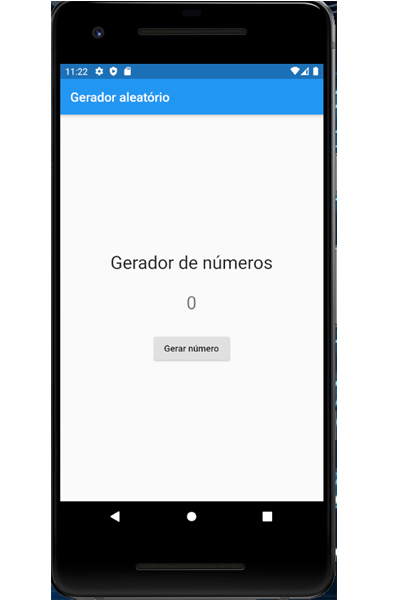

<!-- markdownlint-disable MD026 -->
<!-- markdownlint-disable MD033 -->

# 1. Introdução

## O que vamos aprender?

Neste exemplo vamos construir uma aplicação Flutter bem simples, conforme mostra a Figura 1.

Temos aqui um aplicativo com apenas uma tela e alguns Widgets (componentes):

- Um label estático de título;
- Um botão, que quando clicado vai exibir um número aleatório;
- Um label que vai imprimir o número aleatório na tela.

### Neste exemplo você vai aprender:

- Criar uma aplicação Flutter;
- O conceito dos Widgets StatelessWidget e StatefulWidget;
- Fazer a aplicação responder a um evento (clique do botão).

### O que são StatelessWidget e StatefulWidget?

Uma aplicação Flutter é totalmente construída com base em Widgets, que são basicamente componentes de tela.

No Flutter temos dois tipos principais de Widget:

- **StatelessWidget**: nesse tipo de componente não temos alteração de estado ou valor, por exemplo, um label de título na tela. Nesse caso, o label terá valor fixo durante toda a vida da aplicação, e por isso será ‘Stateless’;
- **StatefulWidget**: aqui temos o oposto: componentes que sofrerão algum tipo de mudança. Por exemplo, em uma aplicação de calculadora, o label onde vamos imprimir o resultado do cálculo.

> Widgets são, basicamente, componentes de tela.

### O que são eventos?

Os eventos são resultados de ações. Um evento é acionado por interações do usuário com a aplicação, ou de outras maneiras, como resposta a uma ação interna do próprio aplicativo.

Exemplos:

*Quando o usuário clica em um botão na tela, um evento pode ser disparado.*
*Quando o usuário digita algo na aplicação, um evento pode ser disparado.*

Existem diferentes tipos de eventos em uma aplicação Mobile, mas não se preocupe, isso é algo que você vai aprendendo conforme sua evolução no Flutter.

### StatelessWidget e StatefulWidget - por que isso é útil?

Componentes **estáticos** e **dinâmicos** são conceitos fundamentais para o entendimento da programação em Flutter.

Reforçando:

- Componentes estáticos = StatelessWidget
- Componentes dinâmicos = StatefulWidget

### Eventos - por que isso é útil?

Os eventos são usados para trabalhar em conjunto com StatefulWidgets. Ou seja, através dos eventos conseguimos programar o comportamento do componente em uma mecânica de `reagir ao evento`.

Por exemplo, quando o usuário pressionar um botão a aplicação deve exibir uma mensagem. Temos então um evento relacionado ao pressionamento do botão, e um código de reação a esse evento, no caso, um código para exibir uma mensagem na tela.

>**Checkpoint**
>A programação em Flutter é baseada em componentes estáticos e dinâmicos.

| [voltar](../README.md) | [Avançar](info-02.md) |
