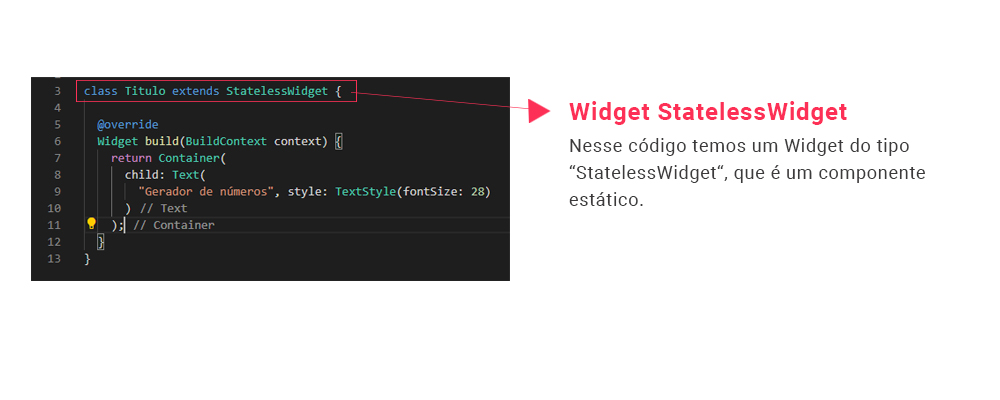

# 2. Uma primeira visão do exemplo

O primeiro passo para entendermos a mecânica de programação do Flutter é nos acostumarmos com o conceito de componentes estáticos e dinâmicos - **StatelessWidgets** e **StatefulWidgets**.

Nesse momento você não precisa se preocupar em dominar o código, pois o mais importante aqui é entender a estrutura de criação destes componentes.

Em resumo, funciona assim: componentes estáticos possuem um bloco de código apenas, que descreve o componente visualmente.

Componentes dinâmicos possuem dois blocos de código: um para definir o componente em si e outro para definir o seu comportamento. Veja a seguir uma visão resumida do conceito:

>**Checkpoint**
>Componentes estáticos possuem um bloco de código apenas, que o descrevem visualmente.

| [Início](../README.md) |  [Voltar](info-01.md) | [Avançar](info-03.md) |
