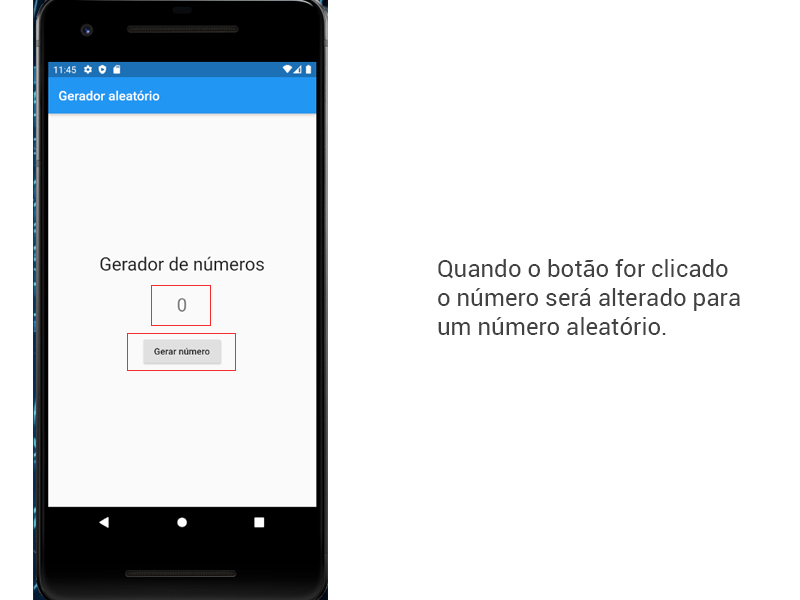
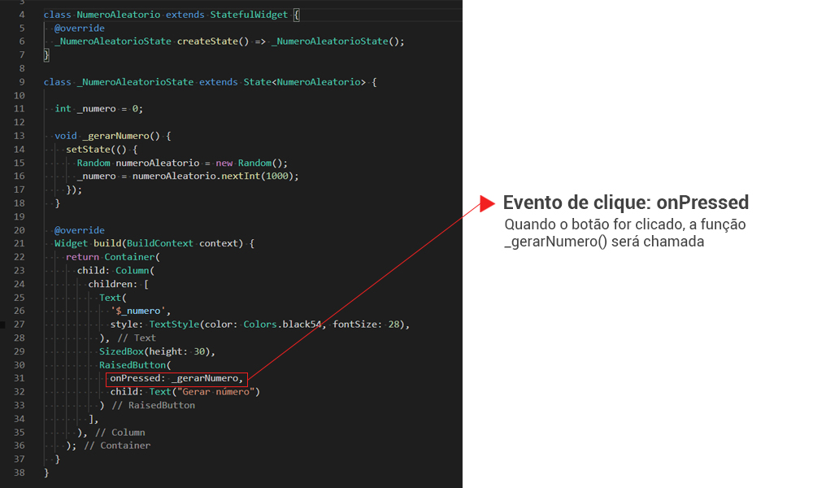
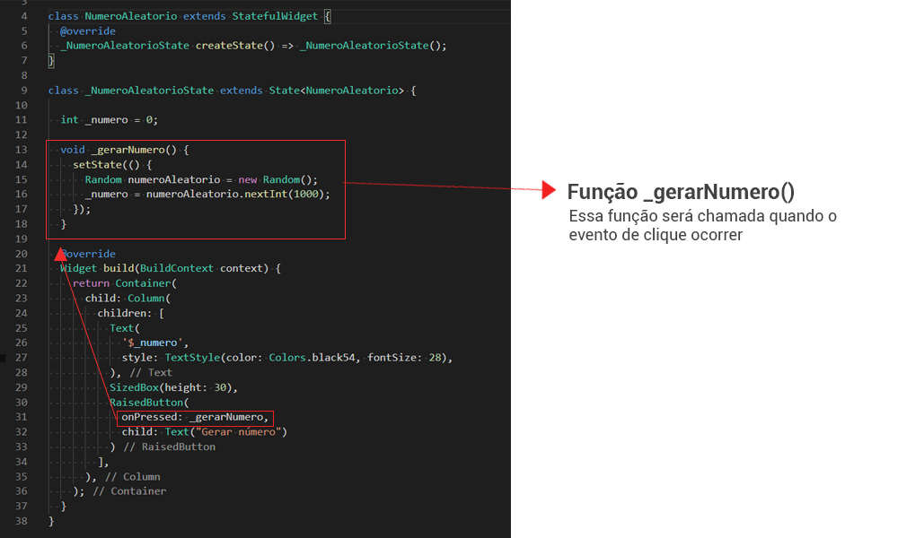

# 3. Evento onPressed: visão do código

Vamos entender agora um pouco sobre o funcionamento do evento do clique do botão de nosso exemplo.

O evento de clique do botão gera um número aleatório tela, como acompanhamos a seguir:

>**Checkpoint**
>Quando o botão é clicado, o evento de clique é acionado e junto a função atribuída a ele.

| [Início](../README.md) | [Voltar](info-02.md) | [Avançar](info-04.md) |
