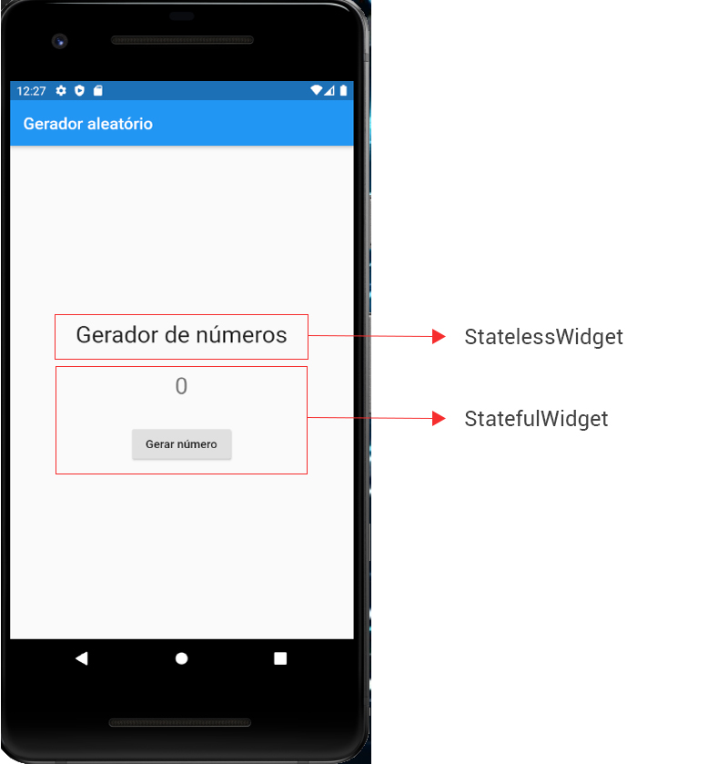

# 4. Entendendo o Exemplo

Na Figura 1 temos a aplicação que gera números aleatórios.



Temos uma tela composta de dois Widgets principais:

- Um StatelessWidget de Texto, que não terá seu conteúdo modificado, contendo apenas o texto `Gerador de números`;
- Um StatefulWidget contendo um botão e um label que terá seu valor alterado com o clique do botão.

Toda vez que o botão da aplicação for clicado, um número randômico será gerado e inserido no valor do Widget de texto acima do botão.

Os trechos principais de código da aplicação serão apresentados a seguir, mas não se preocupe, pois vamos explicar estes com mais detalhes durante o curso. Nesse momento é importante que você entenda a mecânica da programação em Flutter.

## Analisando o código do Widget Título

No **Código 1** temos o label estático.

```dart
class Titulo extends StatelessWidget {
    @override
    Widget build(BuildContext context) {
      return Container(
        child: Text(
          "Gerador de números", style: TextStyle(fontSize: 28)
        )
      );
    }
  }
```

Observe na linha 1 o uso de StatelessWidget na declaração do componente.

No **Código 2** temos o Widget NumeroAleatorio que exibe o botão e o label que vai exibir o número gerado.

```dart
class NumeroAleatorio extends StatefulWidget {
  @override
  _NumeroAleatorioState createState() => _NumeroAleatorioState();
}
  
class _NumeroAleatorioState extends State<NumeroAleatorio> {
  
  int _numero = 0;
  
  void _gerarNumero() {
    setState(() {
      Random numeroAleatorio = new Random();
      _numero = numeroAleatorio.nextInt(1000);
    });
  }
  
  @override
  Widget build(BuildContext context) {
    return Container(
      child: Column(
        children: [
          Text(
            '$_numero',
            style: TextStyle(color: Colors.black54, fontSize: 28),
          ),
          SizedBox(height: 30),
          RaisedButton(
            onPressed: _gerarNumero,
            child: Text("Gerar número")
          )
        ],
      ),
    );
  }
}
```

O código é um pouco maior e parece complexo à primeira vista, mas não se preocupe, pois a sintaxe declarativa do Flutter é fácil de entender com o tempo. 😉

A seguir observe as partes principais deste código.

***Linhas 1 e 6:***

Este componente é dinâmico (StatefulWidget), ou seja, seu valor muda quando o usuário clica no botão. Toda vez que criarmos um StatefulWidget precisamos seguir a mecânica de programação do Flutter que consiste em criar duas classes (e associá-las), como vimos na linhas 1 e 6.

Classe 1 (linha 1):

```dart
class NumeroAleatorio extends StatefulWidget {
```

Classe 2 (linha 6):

```dart
class _NumeroAleatorioState extends State<NumeroAleatorio> {
```

***Linha 3:***

```dart
_NumeroAleatorioState createState() => _NumeroAleatorioState();
```

Aqui temos o código que vincula as duas classes (e monta o StatefulWidget).

***Linhas 27 a 30:***

```dart
RaisedButton(
  onPressed: _gerarNumero,
  child: Text("Gerar número")
)
```

Aqui temos o evento de clique do botão vinculado ao método `_gerarNumero`.

Métodos e propriedades privados são declarados no Flutter com o uso de underline no começo do nome. Exemplos:

```dart
class _NumeroAleatorioState extends State<NumeroAleatorio> {
```

```dart
void _gerarNumero() {
```

```dart
int _numero = 0;
```

>**Checkpoint**
>Toda vez que criarmos um StatefulWidget precisamos criar duas classes e associá-las.

| [Início](../README.md) | [Voltar](info-03.md) | [Avançar](info-05.md) |
