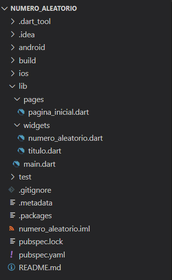
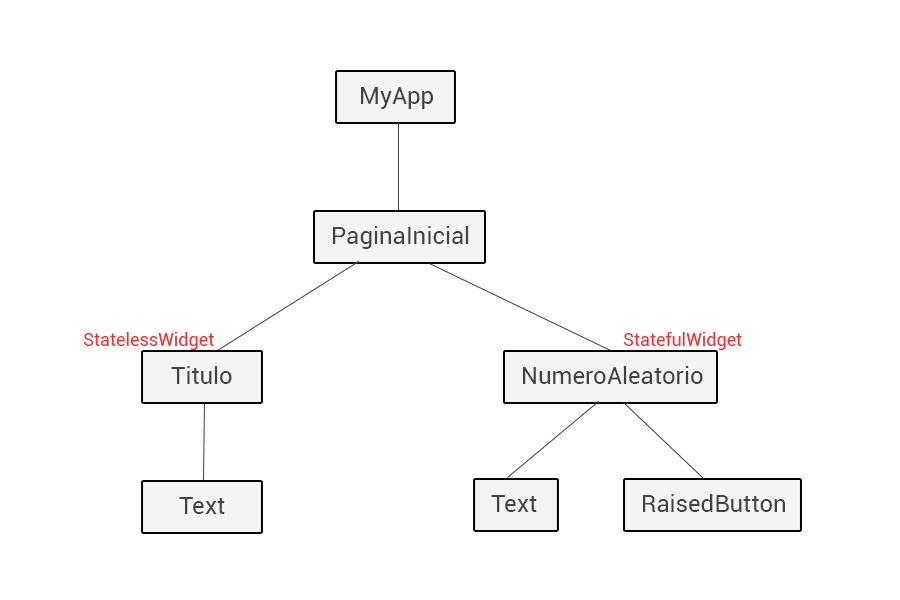

<!-- markdownlint-disable MD026 -->

# 5. Arquitetura do Exemplo

Essa aplicação contém a estrutura de diretórios apresentadas na Figura 1.



⚠️ Os códigos da aplicação estão dentro da pasta `lib`, onde encontramos:

O arquivo `main.dart`, que é o arquivo raiz do projeto;

- A pasta `pages`, que contém o Widget que será a tela/página da aplicação (pagina_inicial.dart);
- A pasta `widgets`, onde temos os widgets que são componentes de uma tela e podem ser reaproveitados (`numero_aleatorio.dart` e `titulo.dart`).

Os arquivos se relacionam através do comando `import` feito na página inicial (`pagina_inicial.dart`), conforme o **Código 1**.

```dart
import 'package:numero_aleatorio/widgets/titulo.dart';
import 'package:numero_aleatorio/widgets/numero_aleatorio.dart';
```

## Arquitetura

Na Figura 2 vamos ver como foi implementada a separação dos widgets na aplicação.



A aplicação é iniciada com o Widget `MyApp`, que contém o Widget `PaginaInicial` como a tela inicial da aplicação.

Nesse Widget que representa a tela temos contidos dois outros Widgets: `Titulo` e `NumeroAleatorio`.

`Titulo` é um componente estático que contém um texto que não sofrerá alteração no seu conteúdo.

`NumeroAleatorio` é um componente dinâmico que contém um Widget `Text` que poderá ter seu valor alterado. Isso ocorrerá toda vez que o botão da aplicação, que é representado pelo Widget `RaisedButton`, for clicado.

>**Checkpoint**
>Os códigos da aplicação estão dentro da pasta **lib**

| [Início](../README.md) | [Voltar](info-04.md) | [Avançar](info-06.md) |
