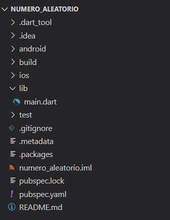
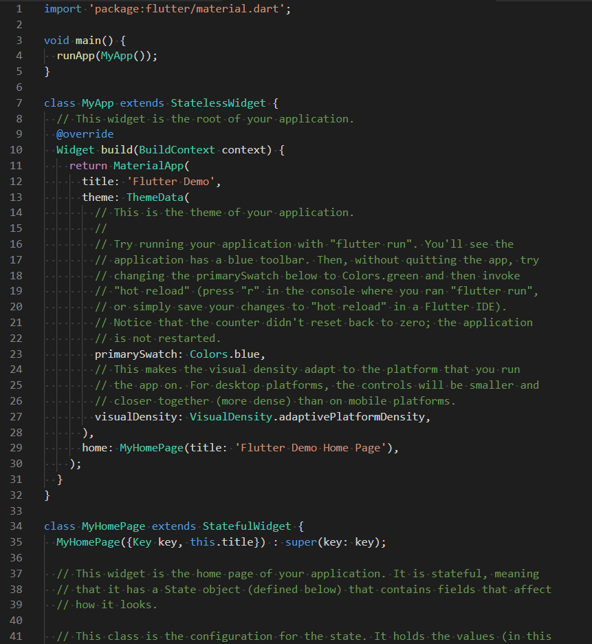

# 6. Criação do projeto

Até aqui já entendemos os principais conceitos da aplicação. 👏👏
Agora, vamos ver a criação do projeto e a implementação de seu código.

Para criar o projeto abra o terminal, navegue até a pasta onde deseja colocar o projeto e digite o comando do **Código 1**.

```shell
flutter create numero_aleatorio
```

Com essa instrução, o projeto flutter é criado na pasta onde esse comando foi executado.

Após a execução do comando a estrutura inicial do projeto, apresentada na **Figura 1**, já estará criada.



O arquivo `main.dart`, localizado dentro da pasta `lib`, é o ponto de partida da aplicação.

Como vimos na introdução do curso, o arquivo é gerado com bastante conteúdo inicial, incluindo comentários etc. Veja na **Figura 2** como o arquivo é iniciado.



O próximo passo é limpar completamente o conteúdo deste arquivo, deixando-o em branco para implementarmos nosso próprio código.

>**Checkpoint**
>Crie seu projeto flutter com o comando **flutter create**

| [Início](../README.md) | [Voltar](info-05.md) | [Avançar](info-07.md) |
