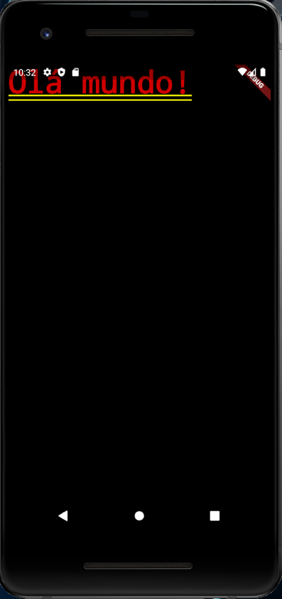
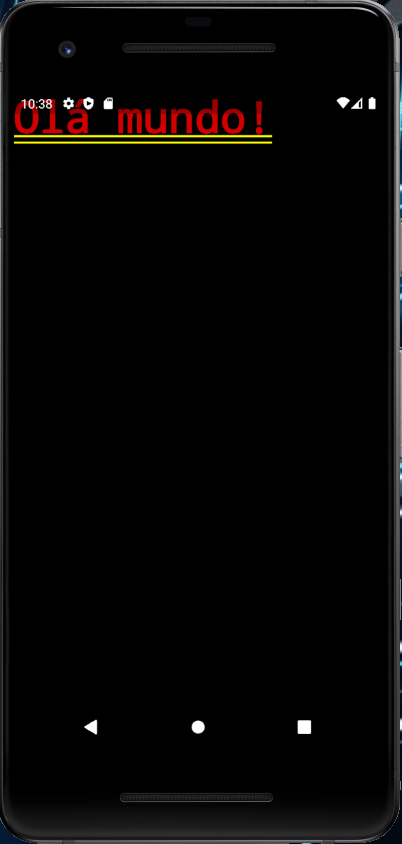

# 7. Criando main.dart

Nosso arquivo inicial `main.dart` está vazio, pois limpamos o conteúdo inicial na aula anterior. 👍

No **Código 1** vemos como deve ficar a primeira versão do código do nosso arquivo.

```dart
import 'package:flutter/material.dart';
  
void main() {
  runApp(MyApp());
}
  
class MyApp extends StatelessWidget {
  @override
  Widget build(BuildContext context) {
    return MaterialApp(
      home: Container(
        child: Text("Olá mundo!"),
      ),
    );
  }
}
```

Observe que o código possui três seções principais:

1. *import*
2. *void main*
3. *class MyApp*

Vamos entender cada uma destas três seções.

***Linha 1:***

```dart
import 'package:flutter/material.dart';
```

Nessa parte do código nós importamos outros arquivos para nossa aplicação. Neste exemplo importamos o pacote do Material Design, que contém os componentes padrão no estilo de aplicativo mobile sugerido pelo Google (criador do Flutter).

***Linha 3:***

```dart
void main() {
  runApp(MyApp());
}
```

Aqui temos o ponto de início da nossa aplicação, que é o método main. Com ele, chamamos o Widget `MyApp` que será exibido na tela.

***Linhas 7 a 15:***

```dart
class MyApp extends StatelessWidget {
  @override
  Widget build(BuildContext context) {
    return MaterialApp(
      home: Container(
        child: Text("Olá mundo!"),
      ),
    );
  }
}
```

Nesta seção temos o primeiro Widget da nossa aplicação, chamado por default no Flutter, de `MyApp`.

MyApp é um componente container, ou seja, será o ***Widget pai*** desta tela da aplicação.

Na linha 7 informamos que este Widget será `StatelessWidget`, pois o componente pai, nesse caso, não terá nenhum valor alterado. O Widget filho `numeroAleatorio`, que será criado em breve, será `StatefulWidget`, mas isso não influencia no componente pai.

A linha 8 representa o método `build`, algo importante pois dentro dele vamos codificar o componente propriamente dito.

O próximo passo é entender o código do método build, presente nas linhas 10 a 14.

Na linha 10 temos o comando return, que retorna um Widget `MaterialApp`, que é o Widget com layout padrão do Flutter.

```dart
home: Container(
  child: Text("Olá mundo!"),
),
```

Na linha 11 temos a propriedade home, que é obrigatória, pois informamos o que será de fato exibido no componente. Podemos inserir o código de layout diretamente ou então **importar** um Widget externo.

Neste momento estamos informando o código de layout diretamente:

```dart
Container(
  child: Text("Olá mundo!"),
)
```

- Container é um valor padrão para ‘englobar’ o código de layout. Dentro de Container temos:
 - `Child`: informa que teremos apenas um Widget (outros Widgets comportam mais de um Widget, e nesse caso usaríamos `children`);
 - `Text`: implementa um label na tela com o texto informado como parâmetro (Olá mundo!).

Vamos rodar a aplicação no emulador para verificarmos como está o nosso código inicial. Para rodar a aplicação digite no terminal o **Código 2**.

```shell
flutter run
```

A aplicação rodando pode ser vista na **Figura 1**.



Repare na **Figura 2** que o Flutter, por padrão, exibe um aviso que a aplicação está em modo Debug.


Para remover este aviso inclua a linha abaixo no código inicial:

```dart
debugShowCheckedModeBanner: false,
```

Com isso vemos o código completo no **Código 3**.

```dart
class MyApp extends StatelessWidget {
    @override
    Widget build(BuildContext context) {
      return MaterialApp(
        debugShowCheckedModeBanner: false,
        home: Container(
          child: Text("Olá mundo!"),
        ),
      );
    }
}
```

Rode novamente a aplicação e veja na **Figura 3** que já não temos o aviso de Debug.



>**Checkpoint**
>**void main** também é obrigatório no arquivo inicial da aplicação

| [Início](../README.md) | [Voltar](info-06.md) | [Avançar](info-08.md) |
