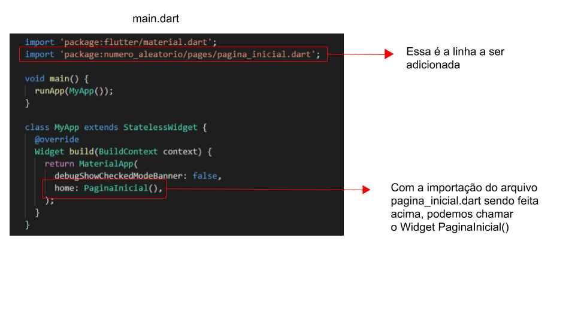

# 8. Página inicial da aplicação

Na **Figura 1** temos a arquitetura da aplicação.


Veja que não vamos chamar diretamente nossos Widgets dentro de `MyApp`. Primeiro vamos criar um Widget central, chamado PaginaInicial, e depois vamos inserir os Widgets filhos dentro de `PaginaInicial`, deixando nosso código mais organizado.

Para que nossa aplicação fique mais organizada, o primeiro passo é criar uma pasta com o nome `pages` (páginas da aplicação) dentro do diretório `lib`.

A estrutura da aplicação deve ficar como apresentada na **Figura 2**.


Em seguida crie um arquivo chamado `pagina_inicial.dart`, que deve ficar dentro da pasta `pages` que acabou de ser criada. É nesse arquivo que ficarão os Widgets que irão compor nossa tela inicial. No **Código 1** temos a primeira versão do código do arquivo `pagina_inicial.dart`.

```dart
import 'package:flutter/material.dart';
  
class PaginaInicial extends StatelessWidget {
  
  @override
  Widget build(BuildContext context) {
    return Scaffold(
      appBar: AppBar(
        title: Text("Gerador aleatório")
      ),
      body: Text("Página Inicial")
    );
  }
}
```

Na primeira linha fazemos o que já vimos na aula anterior: a importação de `material.dart`:

```dart
import 'package:flutter/material.dart';
```

Em seguida iniciamos nosso Widget que será do tipo `StatelessWidget`, pois ele é apenas um container e não sofrerá modificações de valor ou estado:

```dart
class PaginaInicial extends StatelessWidget {
```

No método `build` temos algumas mudanças em relação ao que vimos no `main.dart`. Para entender melhor:


>**Por que MyApp.build retorna MaterialApp e PaginaInicial.build retorna Scaffold?**
>
>Essa diferença faz parte da mecânica e programação baseada em Widgets do Flutter.Em resumo, temos uma árvore padrão de Widgets, que vamos utilizando conforme a necessidade.
>Não é necessário decorar essa árvore de Widgets - quanto mais você programar em Flutter, mais você estará familiarizado com essa estrutura.


No método build retornamos o Widget `Scaffold`, que tem a estrutura de layout do Material Design:

```dart
return Scaffold(
```

Na propriedade `appBar` do Scaffold, usamos o Widget `AppBar`:

```dart
appBar: AppBar(
  title: Text("Gerador aleatório")
)
```

O Widget AppBar (pertencente a Scaffold) adiciona uma barra padrão no topo da tela. A propriedade `title: Text()` indica o conteúdo textual da barra.

Na propriedade `body` definimos um label (Widget Text) com o valor `Página Inicial`:

```dart
body: Text("Página Inicial")
```

Agora vamos importar o arquivo `pagina_inicial.dart` em `main.dart`. Isso permitirá que possamos usar o Widget `PaginaInicial()` no nosso exemplo.

A imagem abaixo mostra como a importação no arquivo `main.dart` é realizada:



Agora, rode a aplicação no emulador e veja as propriedades appbar e body em execução, como na **Figura 3**.


>**Checkpoint**
>O Widget AppBar adiciona uma barra padrão no topo da tela.

| [Início](../README.md) | [Voltar](info-07.md) | [Avançar](info-09.md) |
