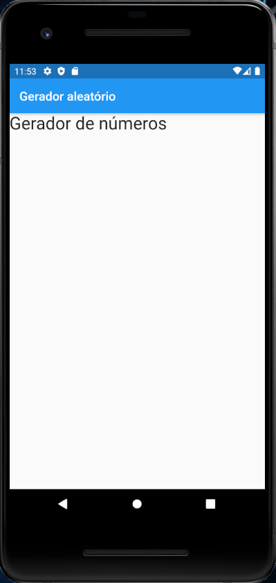
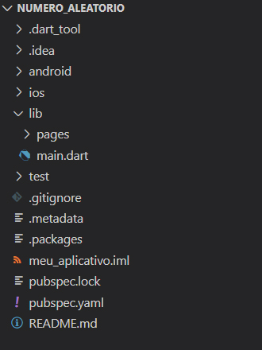
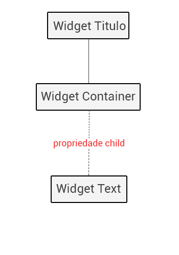

# 9. Criando o Widget Título

Nessa aula criaremos o Widget `Titulo` que será um componente estático em nossa aplicação.

A ideia é que o componente `Titulo` tenha o texto `Gerador de números` e apareça na tela conforme a **Figura 1**.



O primeiro passo é criar uma pasta com o nome `widgets` (componentes da aplicação) dentro do diretório `lib`.

A estrutura da sua aplicação deve ficar conforme apresentada na **Figura 2**.



Em seguida crie um arquivo chamado `titulo.dart`, que deve ficar dentro da pasta `widgets` que acabou de ser criada. Ele deve ter o mesmo conteúdo do **Código 1**.

```dart
import 'package:flutter/material.dart';
  
class Titulo extends StatelessWidget {
  
  @override
  Widget build(BuildContext context) {
    return Container(
      child: Text(
        "Gerador de números",
         style: TextStyle(fontSize: 28)
      )
    );
  }
}
```

Na primeira linha fazemos o que já vimos em aulas anteriores - a importação de `material.dart`. Já na linha 3 temos a declaração do Widget estático, também já visto anteriormente, que no nosso caso terá o nome `Titulo`.

A partir da linha 6 temos o método `build`, onde codificaremos o Widget:

```dart
return Container(
   child: Text(
     "Gerador de números",
     style: TextStyle(fontSize: 28)
   )
);
```

Veja que retornamos o Widget Container: fazendo um paralelo com o HTML, é como se estivéssemos usando uma tag `<DIV>`, ou seja, container server para englobar os elementos.

O Widget de texto `label` será filho Widget Container: na sintaxe do Flutter, isso deve ser indicado através da propriedade `child`. Nele inserimos o texto **Gerador de números**.

Dentro desse Widget podemos estilizar esse texto através da propriedade `style`, na qual colocamos o tamanho da fonte como 28`.

Com o nosso Widget Titulo pronto veremos como importá-lo em `PaginaInicial`, mas isso é assunto para a próxima aula.

Resumindo, a estrutura de Widgets de `titulo.dart` fica igual a **Figura 3**.



>**Checkpoint**
>Widget Container serve para englobar elementos.

| [Início](../README.md) | [Voltar](info-08.md) | [Avançar](info-10.md) |
