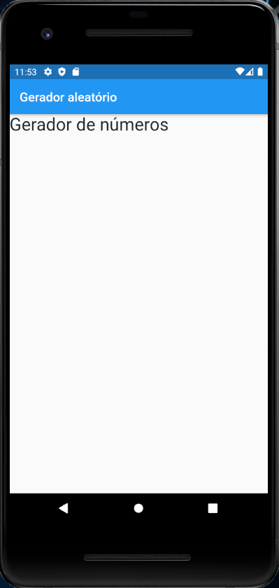
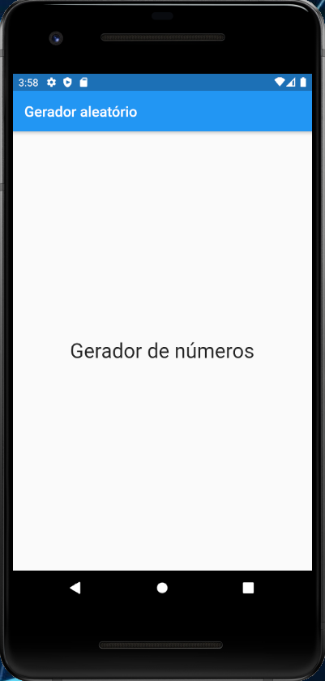

# 10. Importando Widget Titulo para o Widget PaginaInicial

Para ver na tela o Widget que acabamos de construir, devemos importar `titulo.dart` no arquivo `pagina_inicial.dart` com o **Código 1**.

```dart
import 'package:flutter/material.dart';
import 'package:numero_aleatorio/widgets/titulo.dart';
  
class PaginaInicial extends StatelessWidget {
  
  @override
  Widget build(BuildContext context) {
    return Scaffold(
      appBar: AppBar(
        title: Text("Gerador aleatório")
      ),
      body: Titulo()
    );
  }
}
```

***Linha 2:***

```dart
import 'package:numero_aleatorio/widgets/titulo.dart';
```

Aqui estamos importando Widget Título que acabamos de criar. Em seguida precisamos remover o label com o texto `Página Inicial` e inserir no lugar dele o nosso novo Widget (Titulo):

**antes (linha 12):**

```dart
body: Text("Página Inicial")
```

**agora (linha 12):**

```dart
body: Titulo()
```

Rode a aplicação no emulador e o resultado será o mesmo da **Figura 1**.



```dart
body: Center( 
   child: Titulo()
)
```

Na propriedade `body` usamos o Widget Center, pois ele é responsável pela centralização na tela.

Na próxima linha precisamos inserir o Widget `Titulo` dentro da propriedade `child`, fazendo dele um filho de Widget Center. Ele contém nosso texto **Gerador de números**.

A sintaxe do Flutter trabalha assim: um Widget não é inserido diretamente dentro de outro Widget. A sintaxe pede a hierarquia, como mostra o **Código 3**.

```dart
Widget_pai(
   propriedade: Widget_filho
)
```

Dessa forma, queremos inserir o Widget filho `Titulo` dentro do Widget pai `Center`. Assim, precisamos de uma propriedade do Widget Center para fazer isso e a propriedade mais comum para **importar** um Widget filho é `child`, como mostra o **Código 4**.

```dart
Center(
   child: Titulo()
)
```

Com as alterações feitas, a tela da aplicação deve ficar conforme a **Figura 2**.



>**Checkpoint**
>Um Widget não é inserido ‘diretamente’ dentro de outro Widget.

| [Início](../README.md) | [Voltar](info-09.md) | [Avançar](info-11.md) |
