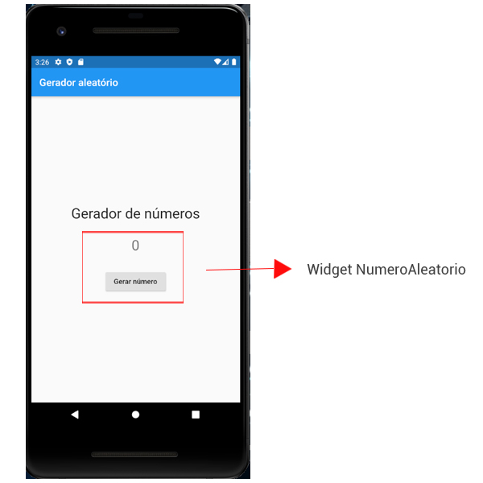

# 11. Criação do Widget NumeroAleatorio

Nessa aula criaremos o nosso Widget `NumeroAleatorio`, que será responsável pela alteração do número na tela. Veremos como criar a primeira parte desse Widget dinâmico, onde estamos mais focados na estrutura do Widget.

No nosso exemplo, ele equivale à seguinte área marcada na **Figura 1**.



O primeiro passo é criar um arquivo com o nome numero_aleatorio.dart dentro da pasta `widgets`, que terá a mesma estrutura inicial do **Código 1**.

```dart
import 'package:flutter/material.dart';
  
 class NumeroAleatorio extends StatefulWidget {
    @override
    _NumeroAleatorioState createState() => _NumeroAleatorioState();
 }
  
 class _NumeroAleatorioState extends State<NumeroAleatorio> {
   @override
   Widget build(BuildContext context) {
    return Container(
      child: Column(
        children: [
          Text(
            "0",
            style: TextStyle(fontSize: 28),
          ),
          SizedBox(height: 30),
          RaisedButton(
            child: Text("Gerar número")
          )
        ],
     ),
    );
  }
}
```

Abaixo descrevemos o que cada trecho faz no código.

A seguir temos a implementação do Widget dinâmico `NumeroAleatorio`:

```dart
class NumeroAleatorio extends StatefulWidget {
```

Ao contrário dos Widgets que vimos até então, esse Widget é do tipo `StatefulWidget`.

Para controlar as informações do nosso Widget, criamos um objeto que vai ser associado com o Widget de estado:

```dart
_NumeroAleatorioState createState() => _NumeroAleatorioState();
```

Abaixo temos a classe que conterá o código do nosso componente dinâmico:

```dart
class _NumeroAleatorioState extends State<NumeroAleatorio> {
```

A partir daqui faremos as alterações das informações do nosso Widget.

No **Código 2** temos o método `build` do nosso Widget.

```dart
Widget build(BuildContext context) {
  return Container(
    child: Column(
      children: [
        Text(
          "0",
          style: TextStyle(fontSize: 28),
        ),
        SizedBox(height: 30),
        RaisedButton(
          child: Text("Gerar número")
        )
      ],
    ),
  );
}
```

Com a **Figura 2** recapitulamos o código de StatefulWidget.


Nesse momento ainda não temos o código de comportamento do Widget, ou seja, o clique do botão implementado. Temos apenas a configuração dos elementos na tela, como mostra a **Figura 3**.


Usamos o Widget Column para que os elementos fiquem alinhados verticalmente (ou seja, um abaixo do outro):

```dart
return Container(
  child: Column(
```

Em seguida precisamos inserir os Widgets filhos que representam o label e o botão. Lembrando que não podemos inserir Widgets dentro de Widgets diretamente, então precisamos de uma propriedade de `Column`.

Nesse caso não podemos usar `child`, pois essa propriedade permite incluir apenas um Widget. Então usamos a propriedade `children` - para incluir mais de um Widget:

```dart
return Container(
  child: Column(
    children: [
```

Por último, dentro da propriedade `children`, inserimos nossos Widgets filhos:

```dart
children: [
  Text(
    "0",
    style: TextStyle(fontSize: 28),
  ),
  SizedBox(height: 30),
  RaisedButton(
    child: Text("Gerar número")
  )
],
```

O Widget `SizedBox` serve para criar um espaçamento entre o label e o botão, no nosso caso com altura de 30 pixels.

>**Checkpoint**
>Por não estar com a propriedade onPressed implementada, o botão ficará desabilitado.

| [Início](../README.md) | [Voltar](info-10.md) | [Avançar](info-12.md) |
