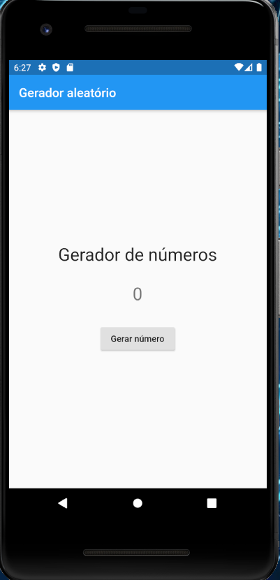

# 13. Importando Widget NumeroAleatorio para o Widget PaginaInicial

Para que a aplicação fique completa, o arquivo pagina_inicial.dart deve ficar conforme o **Código 1**.

```dart
import 'package:flutter/material.dart';
import 'package:numero_aleatorio/widgets/numero_aleatorio.dart';
import 'package:numero_aleatorio/widgets/titulo.dart';
  
class PaginaInicial extends StatelessWidget {
  
  @override
  Widget build(BuildContext context) {
    return Scaffold(
      appBar: AppBar(
        title: Text("Gerador aleatório")
      ),
      body: Center(
        child: Column(
          children: [
            Titulo(),
            SizedBox(height: 30),
            NumeroAleatorio()
          ],
        ),
      )
    );
  }
}
```

Vamos ver as alterações feitas desde a última versão desse arquivo.

Abaixo fazemos a importação do arquivo `numero_aleatorio.dart`, que contém o Widget `NumeroAleatorio` que acabamos de criar:

```dart
import 'package:numero_aleatorio/widgets/numero_aleatorio.dart';
```

Com o trecho a seguir chamamos nosso Widget `NumeroAleatorio` para ser exibido na tela:

```dart
body: Center(
  child: Column(
    children: [
      Titulo(),
      SizedBox(height: 30),
      NumeroAleatorio()
    ],
  ),
)
```

Com isso, nosso Widget `NumeroAleatorio`já está funcionando e podemos ver o resultado na **Figura 1**.


Vamos centralizar o layout no meio da tela. Para isso, basta adicionarmos o seguinte trecho dentro do Widget Column:

```dart
mainAxisAlignment: MainAxisAlignment.center
```

E com isso, deixamos o corpo centralizado no meio da tela, como mostra a **Figura 2**.



O código final do nosso arquivo `pagina_inicial.dart` ficará conforme o **Código 2**.

```dart
import 'package:flutter/material.dart';
import 'package:numero_aleatorio/widgets/titulo.dart';
import 'package:numero_aleatorio/widgets/numero_aleatorio.dart';
  
class PaginaInicial extends StatelessWidget {
  
  @override
  Widget build(BuildContext context) {
    return Scaffold(
      appBar: AppBar(
        title: Text("Gerador aleatório")
      ),
      body: Center(
        child: Column(
          mainAxisAlignment: MainAxisAlignment.center,
          children: [
            Titulo(),
            SizedBox(height: 30),
            NumeroAleatorio()
          ],
        ),
      )
    );
  }
}
```

E nossa aplicação funciona conforme a **Animação 1**.


>**Checkpoint**
>Parabéns, você criou sua primeira aplicação em Flutter 😊

| [Início](../README.md) | [Voltar](info-12.md) |
